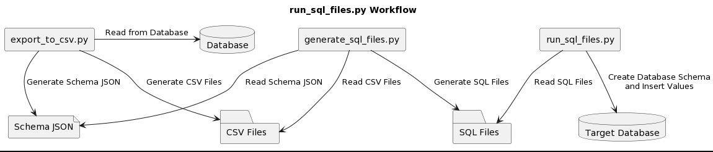
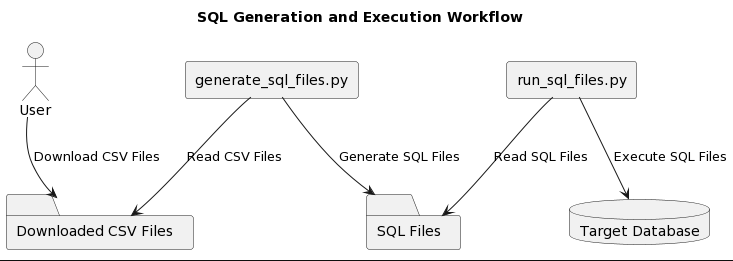

# Workflows

To provide a clear understanding of how the Smart Schema Builder tool is used, let's explore two example workflows that demonstrate its capabilities.

## Workflow 1: Export Database to CSVs, Generate SQL Files, and Execute on Target Database

Imagine you have a MySQL database named `mydb` and you need to migrate it to a PostgreSQL database called `newdb`. To accomplish this, follow these steps:

1. Begin by using the `export_to_csv.py` script to export the schema and data from the MySQL database to CSV files:
   ```bash
   python export_to_csv.py --db-type mysql --host <mysql_host> --port <mysql_port> --database mydb --username <mysql_username> --directory /path/to/csv_files
   ```
   Replace `<mysql_host>`, `<mysql_port>`, and `<mysql_username>` with the appropriate values for your MySQL setup. This command will generate CSV files in the specified directory (`/path/to/csv_files`), representing the schema and data of the MySQL database.

2. Next, utilize the `generate_sql_files.py` script to generate SQL files from the exported CSV files:
   ```bash
   python generate_sql_files.py /path/to/csv_files --db-type postgresql 
   ```
   Replace `/path/to/csv_files` with the path to the directory containing the exported CSV files. This step will generate SQL Data Definition Language (DDL) and INSERT statements based on the CSV files. If you have set up the OpenAI API key, the tool will suggest meaningful table names using the OpenAI API.

3. Finally, execute the generated SQL files against the PostgreSQL database using the `run_sql_files.py` script:
   ```bash
   python run_sql_files.py --db-type postgresql --host <postgresql_host> --port <postgresql_port> --database newdb --username <postgresql_username> --directory /path/to/sql_files
   ```
   Replace `<postgresql_host>`, `<postgresql_port>`, `<postgresql_username>`, and `/path/to/sql_files` with the appropriate values for your PostgreSQL setup. This step will create the necessary tables and populate them with data in the PostgreSQL database. At this point, you have successfully migrated the database schema and data from MySQL to PostgreSQL. However, please note that the migration process is a best-effort attempt and may not fully migrate all primary keys, foreign keys, unique indexes, and other database constraints. It is recommended to review and validate the migrated data to ensure its integrity and correctness in the new database system.

The following diagram illustrates the workflow for exporting a database to CSV files and schema JSON, generating SQL files, and executing them on a target database.


## Workflow 2: Download CSV Dataset, Generate SQL Files, Execute on Target Database
Suppose you have downloaded a dataset in CSV format from a source like [Kaggle](https://www.kaggle.com/) and you want to import it into a test database for analysis and testing purposes. Follow these steps:

1. Start by downloading the public dataset and placing it in a directory. As an example, you can find a dataset [here](https://www.kaggle.com/datasets/arashnic/fitbit) that can be used for testing purposes.

2. Use the `generate_sql_files.py` script to generate SQL files from the CSV dataset:
   ```bash
   python generate_sql_files.py /path/to/csv_file --db-type <database_type>
   ```
   Replace `/path/to/csv_file` with the path to the CSV file, and `<database_type>` with the target database type (`postgresql`, `mysql`, or `sqlserver`). This step will generate SQL DDL and INSERT statements based on the CSV file.

3. Execute the generated SQL files against the target database using the `run_sql_files.py` script:
   ```bash
   python run_sql_files.py --db-type <database_type> --host <database_host> --port <database_port> --database <database_name> --username <username> --directory /path/to/sql_files
   ```
   Replace `<database_type>`, `<database_host>`, `<database_port>`, `<database_name>`, `<username>`, and `/path/to/sql_files` with the appropriate values for your database setup. This step will create the required tables and populate them with data in the target database. As a result, you will have a test database containing the data from the CSV dataset, ready for analysis and testing.


The following diagram illustrates the workflow for downloading a public CSV dataset, generating SQL files, and executing them on a target database.



